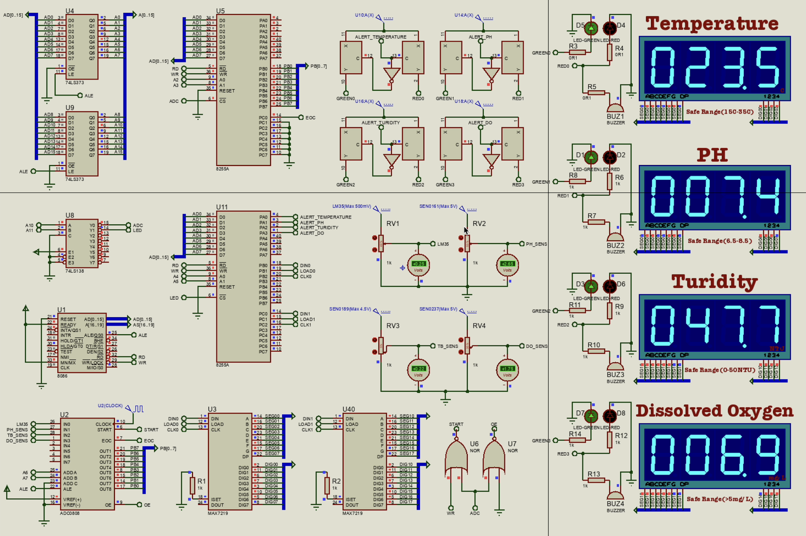

# A Multi-Parameter Water Quality Monitoring System Using 8086 Microcontroller and ADC0808 

## System Architecture: 

- Uses sensors (Temperature, pH, Turbidity, DO) to measure water quality.

- Employs an **ADC0808** to convert analog sensor signals to digital.

- Uses an **8051 microcontroller (AT89C51)** to process and display data.

- Drives **7-segment displays** using **MAX7219**.

- Triggers **alerts** using **comparators (LM339)**, LEDs, and buzzers if readings are out of safe range.

 

## Detailed Flow

### 1. Sensors & Signal Conditioning

Each sensor is connected through a voltage divider (variable resistor for calibration):

-  **RV1 + LM35** → Temperature sensor

-  **RV2 + pH Sensor** → pH level

-  **RV3 + Turbidity Sensor**

-  **RV4 + DO Sensor**

These output analog voltages proportional to the measured parameters.

### **2. Analog Multiplexer (U2 - ADC0808)**

- Accepts 8 analog input channels (A0–A7).

- Converts selected analog signal to digital using 8-bit resolution.

- Controlled via select lines (A, B, C) from the microcontroller.

- **OE**, **START**, **EOC**, and **ALE** are control signals for synchronization.

### **3. 8086 Microcontroller (U1)**

- Central processor that:

    - Selects ADC channel.

    - Starts conversion.

    - Waits for **EOC** (End of Conversion).

    - Reads converted 8-bit value.

    - Sends data to display.

    - Checks thresholds and activates alarms.

### **4. Display Driver (U3, U40 - MAX7219)**

- **MAX7219** takes SPI input from 8051 and drives 7-segment displays.

- 4-digit 7-segment display used for each parameter.

- Each parameter has its own MAX7219 driving it (DIG0–DIG3).

### **5. Alarms (Comparators + LEDs + Buzzers)**

- **LM339 quad comparator** is used for each parameter.
- Receives:

    - One input from sensor signal (via voltage divider).

    - One input from reference voltage (threshold).
- If the sensor value exceeds the reference:

    - Comparator output goes HIGH.

    - Drives RED LED + BUZZER for that parameter.

    - Activates corresponding alert signal to microcontroller.
- Alerts:

    - ALERT_TEMPERATURE
- ALERT_PH
    - ALERT_TURBIDITY
- ALERT_DO

### **6. Multiplexing & Control Logic**

- 74LS373, 74LS573, 74LS138 (U4, U5, U8, U9, U11) handle:

    - Data/address multiplexing.

    - Output enable control.

    - Chip selection.

- Used to expand addressable memory/data lines for the 8051.

### **7. Control Logic for Timing (U6, U7)**

 

- NOR gates combine control signals:

    - Ensure correct timing between ADC **START**, **WR**, **ALE** signals.

    - Avoid data corruption during ADC reading.

 

## Displays

### **7-Segment LEDs**

- 4 separate sections showing:
    - **Temperature** – LM35 (display in °C)
    
    - **pH** – pH Sensor (0–14 scale)
    
    - **Turbidity** – in NTU (Nephelometric Turbidity Units)
    
    - **Dissolved Oxygen** – in mg/L
    
- Each has:

    - 4-digit display

    - Green/Red LED based on safety range

    - Buzzer for alert

    - Safe range labeled for reference

---------

### **Threshold Values and Alert Conditions**

| **Parameter**    | **Safe Range** | **Alert Condition**       | **Signal**        |
| ---------------- | -------------- | ------------------------- | ----------------- |
| Temperature      | 15–35°C        | <15 or >35 triggers alert | ALERT_TEMPERATURE |
| pH               | 6.5–8.5        | Outside this range        | ALERT_PH          |
| Turbidity        | 0–50 NTU       | >50 triggers alert        | ALERT_TURBIDITY   |
| Dissolved Oxygen | >5 mg/L        | <5 triggers alert         | ALERT_D    -         |

 